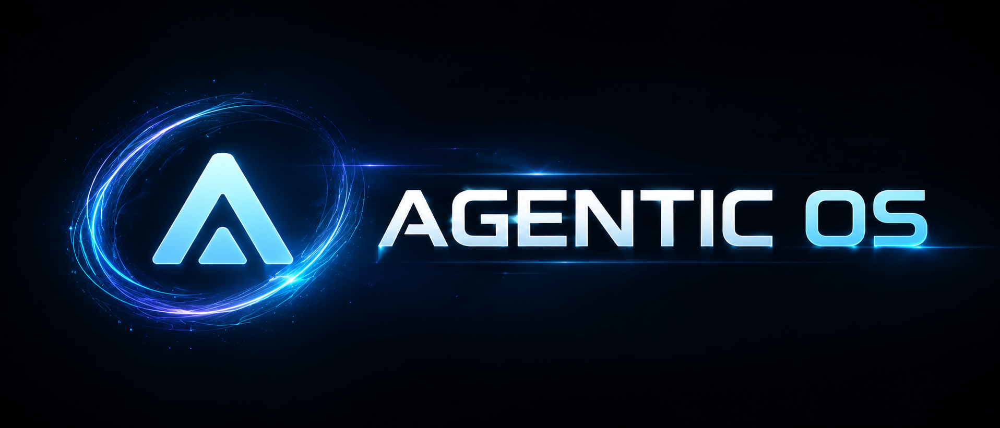

# Hi, I'm HOW2AI 👋

**"Единственное место, где теория ИИ встречается с практикой" 
Мы объединяем глубокие знания экспертов с практическими навыками разработчиков**

 

   

## 🛠️ Skills & Technologies

     

---

Badges generated with [shieldcn](https://shieldcn.dev/gen/profile)